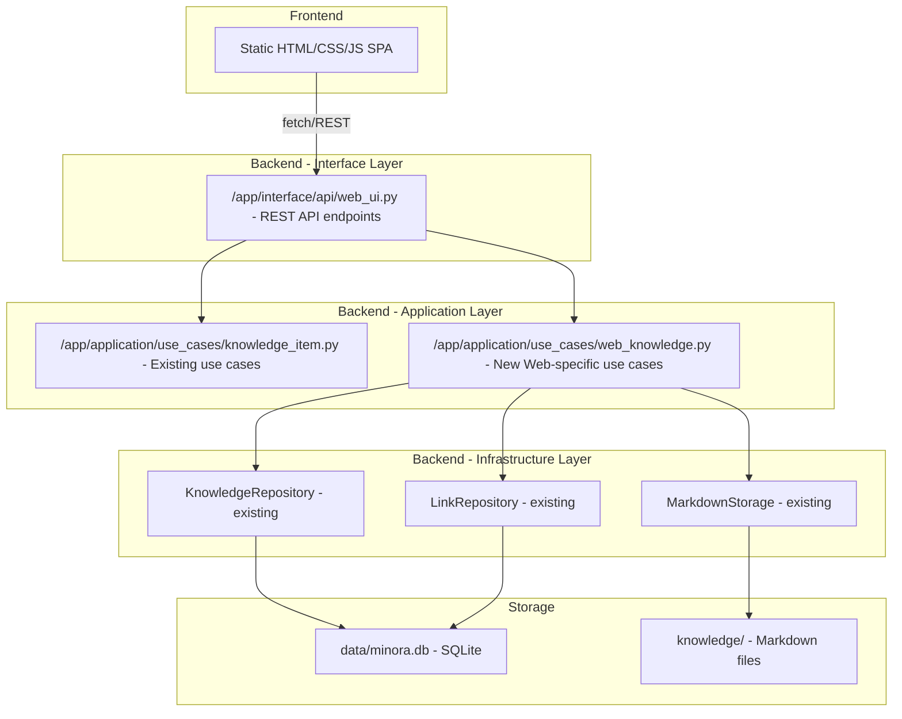

# Minora Knowledge Base Web UI

Build a full-featured Web UI to visualize and interact with the 2-layer knowledge storage system (SQLite metadata DB + markdown files).

## Architecture Overview

The existing codebase follows **clean architecture** (domain → application → infrastructure → interface) with FastAPI as the web framework. The Web UI will be added as a new set of API routes + a static frontend served by FastAPI.

## User Review Required

> [!IMPORTANT]
> **Technology Choice**: The frontend will be a single-page application using vanilla HTML + CSS + JavaScript (no framework), served as static files by FastAPI. This is the simplest approach that doesn't add dependencies.

> [!IMPORTANT]
> **Database Modification**: The Web UI will **NOT** modify the database schema. It will use the existing tables (nodes, edges, tags, node_tags, links, sources, concepts, insights, embeddings) as-is.

> [!WARNING]
> **Config Dependency**: The current `app/infrastructure/config.py` requires Telegram env vars (`telegram_token`, `telegram_webhook_url`). The Web UI server will share the same FastAPI app, so these vars must be set in `.env`. Alternatively, I can create a separate entry point (`app/web_main.py`) that doesn't require Telegram config.

## Open Questions

> [!IMPORTANT]
> **Separate server or same server?** Should the Web UI run as part of the existing Telegram bot FastAPI server, or as a completely separate entry point? I recommend a **separate entry point** (`app/web_main.py`) so it can run independently without Telegram dependencies.

> [!IMPORTANT]
> **Port**: Which port should the Web UI server run on? Default suggestion: `8080` (the Telegram bot uses `8000`).

## Proposed Changes

### Interface Layer - REST API

#### [NEW] [web_ui.py](file:///Users/tgng_mac/Coding/minora/app/interface/api/web_ui.py)

FastAPI router with full REST API for all data entities:

**Knowledge Nodes API** (`/api/nodes`):
- `GET /api/nodes` — List all nodes with filtering (by type, status), sorting (by created_at, updated_at, title), search, and pagination
- `GET /api/nodes/{node_id}` — Get node detail including tags, edges, type-specific metadata, and markdown content
- `POST /api/nodes` — Create new node (writes both DB and markdown)
- `PUT /api/nodes/{node_id}` — Update node fields (title, status, confidence, tags, content, metadata, etc.)
- `DELETE /api/nodes/{node_id}` — Delete node (removes from DB and deletes markdown file)
- `PUT /api/nodes/{node_id}/content` — Replace markdown content only

**Edges API** (`/api/edges`):
- `GET /api/edges` — List edges (filterable by node_id)
- `POST /api/edges` — Create a new edge
- `DELETE /api/edges/{edge_id}` — Delete an edge

**Tags API** (`/api/tags`):
- `GET /api/tags` — List all tags with usage counts

**Links API** (`/api/links`):
- `GET /api/links` — List all links with filtering and pagination
- `GET /api/links/{link_id}` — Get link detail
- `PUT /api/links/{link_id}` — Update link
- `DELETE /api/links/{link_id}` — Delete link

**Stats API** (`/api/stats`):
- `GET /api/stats` — Dashboard statistics (counts per type, recent activity, etc.)

---

### Application Layer - Web Use Cases

#### [NEW] [web_knowledge.py](file:///Users/tgng_mac/Coding/minora/app/application/use_cases/web_knowledge.py)

New use case class `WebKnowledgeUseCase` that extends the existing `KnowledgeItemUseCase` with:
- Structured JSON responses (not string-formatted like the Telegram use case)
- Full CRUD for links
- Edge management
- Statistics aggregation
- Pagination and advanced filtering support

---

### Application Layer - Entry Point

#### [NEW] [web_main.py](file:///Users/tgng_mac/Coding/minora/app/web_main.py)

Separate FastAPI entry point for the Web UI that:
- Doesn't require Telegram configuration
- Mounts static files directory
- Includes only Web UI routes
- Has its own `lifespan` that initializes only the database (no Telegram polling)

---

### Frontend - Static Files

All static files in `app/static/`:

#### [NEW] [index.html](file:///Users/tgng_mac/Coding/minora/app/static/index.html)

Single-page application with these views:
1. **Dashboard** — Overview stats, recent items, type distribution chart
2. **Knowledge Explorer** — Table/grid view of all nodes with search, filter, sort, pagination
3. **Node Detail** — Full view of a node with editable fields, markdown preview, edges, tags
4. **Links Manager** — Table of all links with CRUD
5. **Graph View** — Interactive visualization of node relationships

#### [NEW] [style.css](file:///Users/tgng_mac/Coding/minora/app/static/style.css)

Premium dark-mode design system with:
- CSS custom properties for theming
- Glassmorphism cards
- Smooth animations and transitions
- Responsive layout (sidebar + main content)
- Data table styles with hover states
- Modal dialogs for create/edit
- Toast notifications
- Tag chips with colors per type

#### [NEW] [app.js](file:///Users/tgng_mac/Coding/minora/app/static/app.js)

Client-side JavaScript with:
- Router (hash-based navigation)
- API client layer
- Component rendering functions for each view
- Real-time search with debouncing
- Sort/filter/pagination state management
- Modal forms for CRUD operations
- Toast notification system
- Markdown content rendering

---

### Configuration

#### [NEW] [web_config.yaml](file:///Users/tgng_mac/Coding/minora/configs/web_config.yaml)

Web UI specific configuration:
- Port, host
- Items per page
- Knowledge root directory

---

## Feature Matrix

| Feature | Nodes | Links | Edges | Tags |
|---------|-------|-------|-------|------|
| List/Browse | ✅ | ✅ | ✅ | ✅ |
| Search | ✅ | ✅ | — | ✅ |
| Filter | ✅ type, status | ✅ status, source_type | ✅ type | — |
| Sort | ✅ | ✅ | ✅ | ✅ |
| Pagination | ✅ | ✅ | ✅ | — |
| Create | ✅ | — | ✅ | — |
| Edit (all fields) | ✅ | ✅ | — | — |
| Delete | ✅ | ✅ | ✅ | — |
| Replace content | ✅ | — | — | — |
| View detail | ✅ | ✅ | — | — |
| Markdown preview | ✅ | — | — | — |

## UI Design

The Web UI will have a **dark-mode, sidebar-based layout**:

- **Sidebar**: Navigation with icons for Dashboard, Knowledge, Links, Graph
- **Main Content**: Dynamic based on selected view
- **Design tokens**: Deep indigo/purple gradients, glass-effect cards, emerald/amber/rose accent colors per node type
- **Typography**: Inter font from Google Fonts
- **Micro-animations**: Card hover lifts, smooth page transitions, loading skeletons

## Verification Plan

### Automated Tests
1. Start the Web UI server: `conda run -n minora python -m app.web_main`
2. Verify all API endpoints return correct data using browser tool
3. Navigate through all frontend views and verify rendering
4. Test CRUD operations (create, edit, delete a node)
5. Test search, filter, and sort functionality

### Manual Verification
- Visual inspection of the UI design in the browser
- Test responsiveness on different viewport sizes
