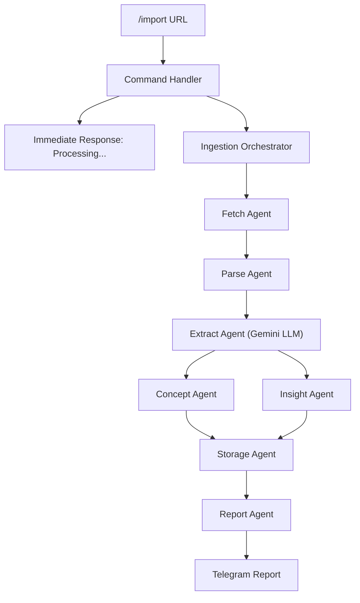

# Walkthrough: Multi-Agent Ingestion Pipeline

## What Was Built

A production-ready multi-agent ingestion pipeline that transforms `/import <url>` from a stub demo into a fully functional AI-powered knowledge extraction system.

### Architecture



---

## Changes Made

### Phase 1: Configuration & LLM Infrastructure

| File | Action | Purpose |
|------|--------|---------|
| [agents.yaml](file:///Users/tgng_mac/Coding/minora/configs/agents.yaml) | NEW | Centralized YAML config for all agents |
| [config.py](file:///Users/tgng_mac/Coding/minora/app/infrastructure/config.py) | MODIFY | Added `gemini_api_keys`, `agents_config_path` |
| [provider.py](file:///Users/tgng_mac/Coding/minora/app/infrastructure/llm/provider.py) | NEW | Abstract LLM provider interface |
| [gemini_provider.py](file:///Users/tgng_mac/Coding/minora/app/infrastructure/llm/gemini_provider.py) | NEW | Gemini API with key rotation & retry |

**Key design: Gemini key rotation** — Round-robin through `GEMINI_API_KEYS` with automatic fallback on 429/500 errors and exponential backoff.

### Phase 2: Agent Framework (7 Agents)

| File | Agent | LLM? | Purpose |
|------|-------|------|---------|
| [base_agent.py](file:///Users/tgng_mac/Coding/minora/app/infrastructure/agents/base_agent.py) | Base | - | Logging, error handling wrapper |
| [fetch_agent.py](file:///Users/tgng_mac/Coding/minora/app/infrastructure/agents/fetch_agent.py) | Fetch | No | HTTP fetch via httpx |
| [parse_agent.py](file:///Users/tgng_mac/Coding/minora/app/infrastructure/agents/parse_agent.py) | Parse | No | HTML → clean text via BeautifulSoup |
| [extract_agent.py](file:///Users/tgng_mac/Coding/minora/app/infrastructure/agents/extract_agent.py) | Extract | **Yes** | Summary, key points, concepts, entities |
| [concept_agent.py](file:///Users/tgng_mac/Coding/minora/app/infrastructure/agents/concept_agent.py) | Concept | No | Map/create concepts, build edges |
| [insight_agent.py](file:///Users/tgng_mac/Coding/minora/app/infrastructure/agents/insight_agent.py) | Insight | **Yes** | Generate non-obvious insights |
| [storage_agent.py](file:///Users/tgng_mac/Coding/minora/app/infrastructure/agents/storage_agent.py) | Storage | No | Save to markdown + DB |
| [report_agent.py](file:///Users/tgng_mac/Coding/minora/app/infrastructure/agents/report_agent.py) | Report | No | Format Telegram message |

### Phase 3: Orchestrator

[ingestion_orchestrator.py](file:///Users/tgng_mac/Coding/minora/app/application/use_cases/ingestion_orchestrator.py) — Central brain that runs Fetch → Parse → Extract → [Concept + Insight in parallel] → Storage → Report.

### Phase 4: Database Schema Refactor

[models.py](file:///Users/tgng_mac/Coding/minora/app/infrastructure/database/models.py) — Added `source_type`, `ingested_by`, `title_extracted`, `summary`, `content_hash` to `SourceMetadataRecord`.

[__init__.py](file:///Users/tgng_mac/Coding/minora/app/infrastructure/database/__init__.py) — Added safe migration via `ALTER TABLE ADD COLUMN` (idempotent).

### Phase 5: Command System Extension

| File | Change |
|------|--------|
| [command_context.py](file:///Users/tgng_mac/Coding/minora/app/domain/entities/command_context.py) | NEW — Context with messenger for async commands |
| [command.py](file:///Users/tgng_mac/Coding/minora/app/domain/entities/command.py) | Added `requires_context` flag |
| [command_dispatcher.py](file:///Users/tgng_mac/Coding/minora/app/application/services/command_dispatcher.py) | Passes context to context-aware handlers |
| [config.py handlers](file:///Users/tgng_mac/Coding/minora/app/infrastructure/commands/handlers/config.py) | `/import` now runs full pipeline async |

**2-phase response pattern:**
1. User sends `/import <url>` → immediate "Processing..." response
2. Pipeline runs in background → sends full report when done

### Phases 6-7: Commands & Markdown

- `/find`, `/list`, `/read`, `/update`, `/delete`, `/visualize` already work against real DB data via `KnowledgeItemUseCase`
- Storage agent generates enriched markdown with full frontmatter per `file-content.md` spec

---

## Testing

**87 tests passed in 0.63s** — all existing tests preserved + 14 new tests added.

New test files:
- [test_gemini_provider.py](file:///Users/tgng_mac/Coding/minora/tests/unit/test_gemini_provider.py) — 10 tests
- [test_agents.py](file:///Users/tgng_mac/Coding/minora/tests/unit/test_agents.py) — 8 tests  
- [test_ingestion_orchestrator.py](file:///Users/tgng_mac/Coding/minora/tests/unit/test_ingestion_orchestrator.py) — 3 tests

---

## Setup to Use

1. Add Gemini API key(s) to `.env`:
   ```
   GEMINI_API_KEYS=your_key_1,your_key_2
   ```

2. Start the bot:
   ```bash
   conda activate minora
   python -m app.main
   ```

3. Send in Telegram:
   ```
   /import https://en.wikipedia.org/wiki/Large_language_model
   ```

4. Query results:
   ```
   /find llm
   /list
   /visualize
   ```
